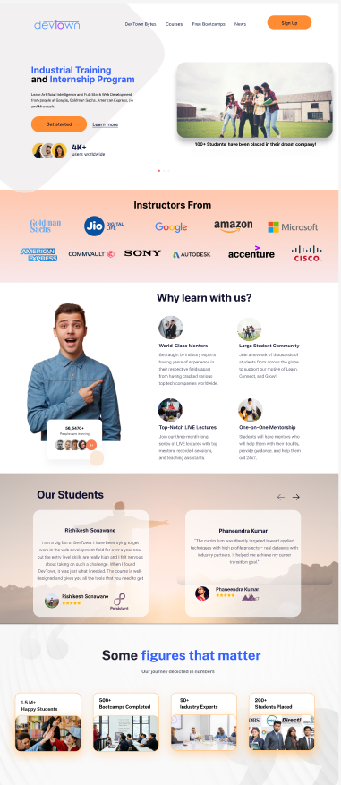
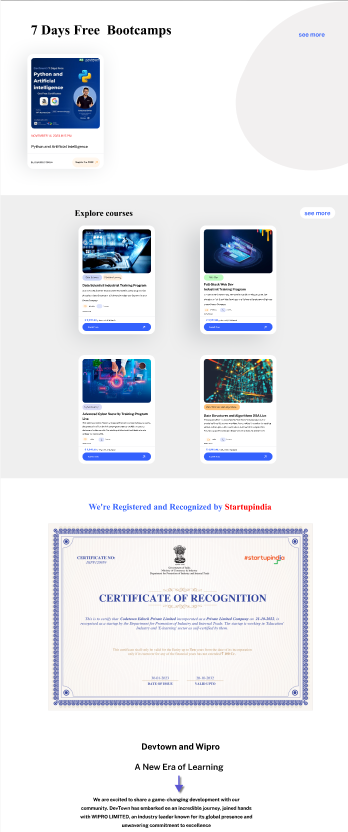
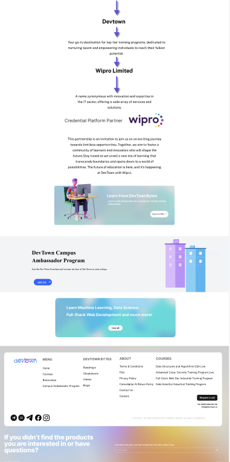

# 🚀 DevTown UI Design System

Welcome to the **DevTown UI Design System repository** — a complete, ready-to-deploy asset kit for DevTown’s next-gen educational platform. Designed with futuristic aesthetics, recognition from industry partners, and a focus on learner engagement.

---

### 🌐 Project Overview

This repo contains the polished, production-ready UI assets for the DevTown platform—a powerful bootcamp and training workspace for ambitious learners.

- **Figma-crafted, pixel-perfect design system**
- **Exported PNGs for immediate integration**
- **Recognized by StartupIndia and Wipro Limited**
- **Responsive, accessibility-first layouts**
- **Branded for trust, clarity, and education at scale**

---

### 📸 Screenshots

**Landing Page 1**

**Landing Page 2**

**Landing Page 3**

---

### ⚡ Features

- **7-Day Free Bootcamps**  
  Accessible learning—get started instantly.

- **Explore Courses**  
  Interactive course catalog infused with modern UI and powerful CTAs.

- **Official Certificate Recognition**  
  Direct partnership and credentials from *StartupIndia* and *Wipro*.

- **Statistics that Matter**  
  Real numbers: user impact, courses completed, mentors, and industry experts.

- **Live Testimonials & Community**  
  See user success stories and learn from the best instructors worldwide.

- **Future-Proof & Modular**  
  Assets optimized for web, mobile, and expansion as DevTown evolves.

---

### 🛠️ Repository Structure
devtown-design/
├── assets/
│ └── logos/ # Brand and partner logos
├── screens/
│ └── png/
│ ├── devtown-landing-1.png
│ ├── devtown-landing-2.png
│ └── devtown-landing-3.png
└── README.md

---

### 👤 Credits

- **Design & Repository Owner:** [Pranay Kumar](https://github.com/mudigondapranay)
  - [Behance Portfolio](https://www.behance.net/pranaykumar23)
  - [LinkedIn](https://www.linkedin.com/in/mudigondapranay/)

**Assets designed in Figma and exported for pixel-perfect implementation.**

---

### 🔗 Related Projects

- [DevTown UI Website Design — Behance](https://www.behance.net/pranaykumar23)
- DevTown Registration Figma Kit (private; contact for access)
- Collaboration inquiries welcome!

---

### 🤝 Contribution & License

Interested in collaborating or suggesting improvements?  
Open an issue or submit a pull request.

This project and its contents are proprietary.  
Usage is subject to DevTown's licensing terms.

---

### 📬 Contact

For questions or partnership opportunities, please connect via [GitHub Issues](https://github.com/mudigondapranay/devtown-design/issues)  
or [LinkedIn](https://www.linkedin.com/in/mudigondapranay/).

---

> **Empowering a new era of learning through design.**  
> _Last updated: August 2025_

